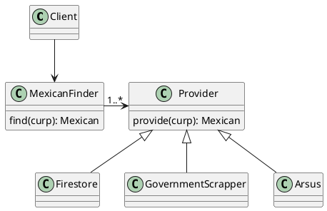

# CURP

>  Verify CURP and obtain personal information from the Mexican government CURP.

Inspired by [node-module-boilerplate](https://github.com/sindresorhus/node-module-boilerplate)

# How to Start Using CURP package?


## Getting started
```typescript
import { GovernmentScrapper, CaptchaSolver, Arsus } from "providers";
import { Mexican } from "models";
import { CaptchaSolver } from "shared";

const mexicanFinder = new MexicanFinder(
  // Your own database.
  new Firestore(),
  // Other providers: Arsus, Conectame2, ...
  new Arsus("apiKey"),
  // 2Captcha ApiKey https://2captcha.com/enterpage
  new GovernmentScrapper(new CaptchaSolver("apiKey"))
);
const mexican: Mexican = await mexicanFinder.find(new Curp('CURP'));
if (mexicanFinder.finalState() != 'Firestore') {
  // Save mexican
  new Firestore().save(mexican);
}
```