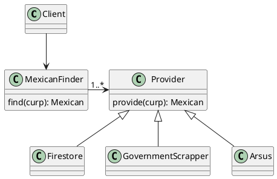

# CURP

>  Verify CURP and obtain personal information from the Mexican government CURP.

Inspired by [node-module-boilerplate](https://github.com/sindresorhus/node-module-boilerplate)
# Installing
```
npm i get-mexican-data-by-curp
```
# Express demo template
[Express demo template](https://github.com/sanchezcarlosjr/curp-server-ts)

# How to Start Using CURP package?




## Getting started
```typescript
import { GovernmentScrapper, CaptchaSolver, Arsus } from "get-mexican-data-by-curp";
import { Mexican } from "get-mexican-data-by-curp";
import { CaptchaSolver } from "get-mexican-data-by-curp";

const mexicanFinder = new MexicanFinder(
  // Your own database.
  new Firestore(),
  // Other providers: Arsus, Conectame, ...
  new Arsus("apiKey"),
  // 2Captcha ApiKey https://2captcha.com/enterpage
  new GovernmentScrapper(new CaptchaSolver("apiKey"))
);
const mexican: Mexican = await mexicanFinder.find(new Curp('CURP'));
if (mexicanFinder.finalState() !== 'Firestore') {
  // Save mexican
  new Firestore().save(mexican);
}
```

# Your custom providers
## Firestore example
```typescript
import { getFirestore } from 'firebase-admin/lib/firestore';
import { Curp } from 'get-mexican-data-by-curp';
import { Provider } from 'get-mexican-data-by-curp';
import { GovernmentScrapperCache } from 'get-mexican-data-by-curp';
import { Mexican } from 'get-mexican-data-by-curp';

export class Firestore extends Provider implements GovernmentScrapperCache {
  constructor(
    private documentPath: (curpValue: string) => string = curpValue =>
      `id/${curpValue}`
  ) {
    super();
  }
  // eslint-disable-next-line @typescript-eslint/explicit-module-boundary-types
  save(mexican: Mexican): Promise<any> {
    if (mexican === undefined || mexican.curp === undefined) {
      throw new Error('Provider error');
    }
    return getFirestore().collection('id').doc(mexican.curp).set(mexican);
  }
  // eslint-disable-next-line @typescript-eslint/explicit-module-boundary-types
  provide(curp: Curp) {
    // eslint-disable-next-line @typescript-eslint/no-unsafe-return,@typescript-eslint/no-unsafe-call,@typescript-eslint/no-unsafe-member-access
    return getFirestore()
      .doc(this.documentPath(curp.value))
      .get()
      .then((document: { exists: any; data: () => any }) => {
        if (!document.exists) {
          return null;
        }
        const data = document.data();
        // eslint-disable-next-line @typescript-eslint/no-unsafe-member-access
        if (data.error) {
          return {
            curp: curp.value,
            // eslint-disable-next-line @typescript-eslint/no-unsafe-member-access
            error: data.error,
          };
        }
        // eslint-disable-next-line @typescript-eslint/no-unsafe-return
        return data;
      });
  }
}
```
