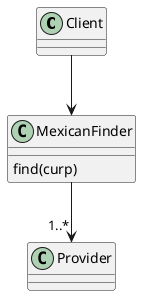

# CURP

>  Verify CURP and obtain personal information from the Mexican government CURP.

Inspired by [node-module-boilerplate](https://github.com/sindresorhus/node-module-boilerplate)

# How to Start Using CURP package?


```typescript
import { GovernmentScrapper, Firestore, CaptchaSolver } from "providers";
import { Mexican } from "models";
import { CaptchaSolver } from "shared";

const mexicanFinder = MexicanFinder(
  // If you want to use another database inherits provider.
  new Firestore(),
  // 2Captcha ApiKey https://2captcha.com/enterpage
  new GovernmentScrapper(new CaptchaSolver("apiKey"))
);
const mexican: Mexican = await mexicanFinder.find(new Curp('CURP'));
```

# Features

- [Semantic Release](https://github.com/semantic-release/semantic-release)
- [Issue Templates](https://github.com/johnsmith/my-cool-package/tree/main/.github/ISSUE_TEMPLATE)
- [GitHub Actions](https://github.com/johnsmith/my-cool-package/tree/main/.github/workflows)
- [Codecov](https://about.codecov.io/)
- [VSCode Launch Configurations](https://github.com/johnsmith/my-cool-package/blob/main/.vscode/launch.json)
- [TypeScript](https://www.typescriptlang.org/)
- [Husky](https://github.com/typicode/husky)
- [Lint Staged](https://github.com/okonet/lint-staged)
- [Commitizen](https://github.com/search?q=commitizen)
- [Jest](https://jestjs.io/)
- [ESLint](https://eslint.org/)
- [Prettier](https://prettier.io/)

## Getting started