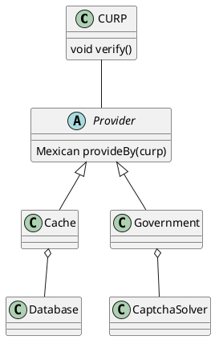

Domain model

```puml
@startuml
class CURP {
  void verify()
}
abstract        Provider {
  Mexican provideBy(curp)
} 
Provider  <|-- Cache
Provider <|-- Government
CURP -- Provider
Government o-- CaptchaSolver
Cache  o-- Database
@enduml
```